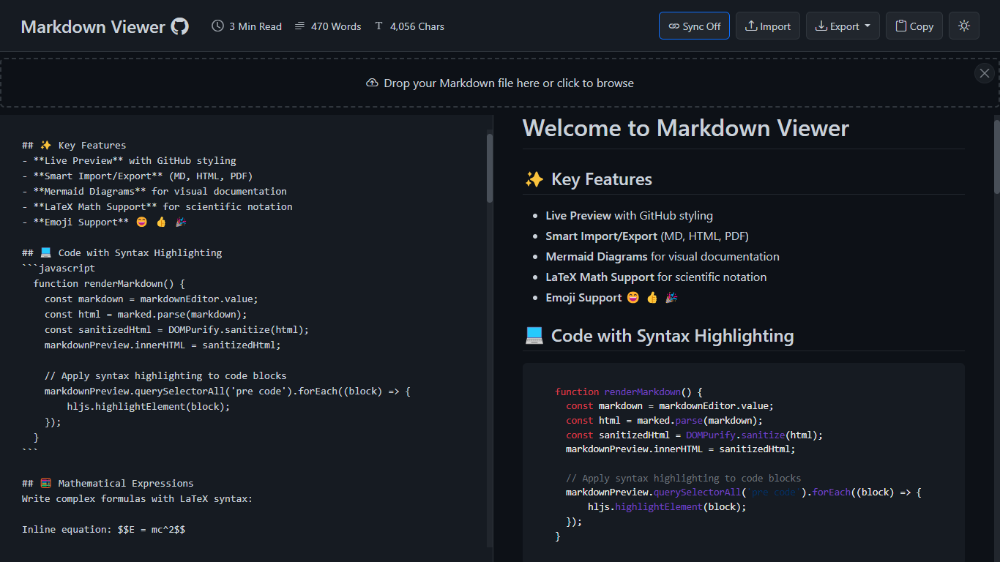
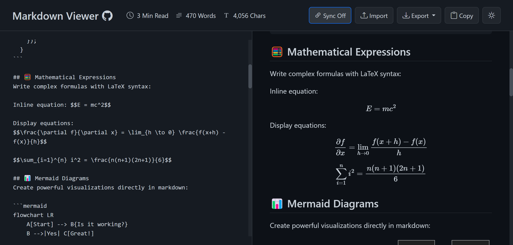
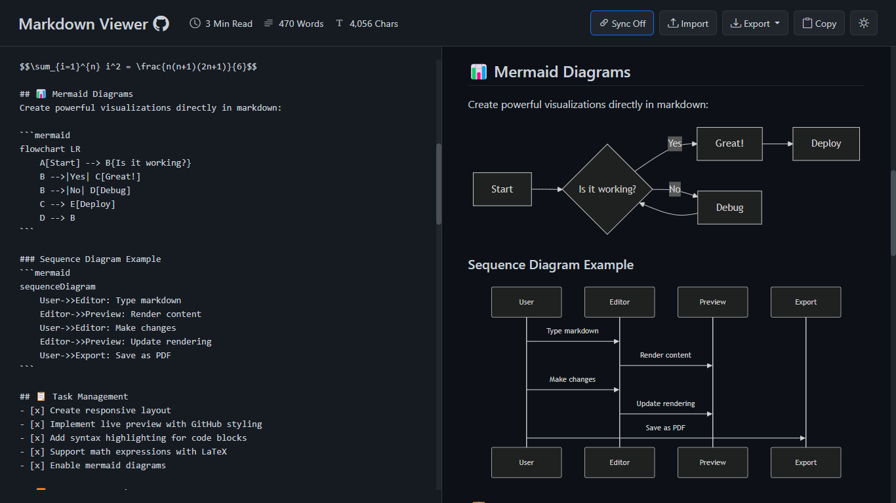
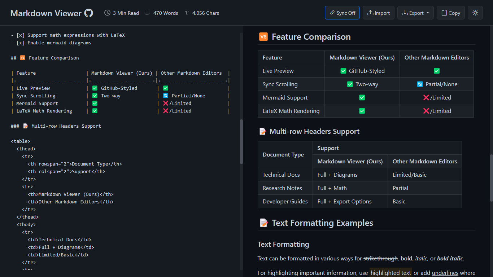

# Markdown Viewer

    
    <h3>A powerful GitHub-style Markdown rendering tool</h3>
    
Fast, secure, and feature-rich - all running in your browser

    <a href="https://markdownviewer.pages.dev/">Live Demo</a> • 
    <a href="#-features">Features</a> • 
    <a href="#-screenshots">Screenshots</a> • 
    <a href="#-usage">Usage</a> • 
    <a href="#-license">License</a>

## 🚀 Overview

Markdown Viewer is a professional, full-featured Markdown editor and preview application that runs entirely in your browser. It provides a GitHub-style rendering experience with a clean split-screen interface, allowing you to write Markdown on one side and instantly preview the formatted output on the other.

## ✨ Features

- **GitHub-style Markdown rendering** - See your Markdown exactly as it would appear on GitHub
- **Live preview** - Instantly see changes as you type
- **Syntax highlighting** - Beautiful code highlighting for multiple programming languages
- **LaTeX math support** - Render mathematical equations using LaTeX syntax
- **Mermaid diagrams** - Create diagrams and flowcharts within your Markdown
- **Dark mode toggle** - Switch between light and dark themes for comfortable viewing
- **Export options** - Download your content as Markdown, HTML, or PDF
- **Import Markdown files** - Drag & drop or select files to open
- **Copy to clipboard** - Quickly copy your Markdown content with one click
- **Sync scrolling** - Keep editor and preview panes aligned (toggleable)
- **Content statistics** - Track word count, character count, and reading time
- **Fully responsive** - Works on desktop and mobile devices
- **Emoji support** - Convert emoji shortcodes into actual emojis
- **100% client-side** - No server processing, ensuring complete privacy and security
- **No sign-up required** - Use instantly without any registration

## 📸 Screenshots

### Code Syntax Highlighting

### Mathematical Expressions Support

### Mermaid Diagrams

### Tables Support

## 📝 Usage

1. **Writing Markdown** - Type or paste Markdown content in the left editor panel
2. **Viewing Output** - See the rendered HTML in the right preview panel
3. **Importing Files** - Click "Import" or drag and drop .md files into the interface
4. **Exporting Content** - Use the "Export" dropdown to download as MD, HTML, or PDF
5. **Toggle Dark Mode** - Click the moon icon to switch between light and dark themes
6. **Toggle Sync Scrolling** - Enable/disable synchronized scrolling between panels

### Supported Markdown Features

- Headings (# H1, ## H2, etc.)
- **Bold** and *italic* text
- ~~Strikethrough~~
- [Links](https://example.com)
- Images
- Lists (ordered and unordered)
- Tables
- Code blocks with syntax highlighting
- Blockquotes
- Horizontal rules
- Task lists
- LaTeX equations (inline and block)
- Mermaid diagrams
- And more!

## 🔧 Technologies Used

- HTML5
- CSS3
- JavaScript
- [Bootstrap](https://getbootstrap.com/) - Responsive UI framework
- [Marked.js](https://marked.js.org/) - Markdown parser
- [highlight.js](https://highlightjs.org/) - Syntax highlighting
- [MathJax](https://www.mathjax.org/) - Mathematical expressions
- [Mermaid](https://mermaid-js.github.io/mermaid/) - Diagrams and flowcharts
- [DOMPurify](https://github.com/cure53/DOMPurify) - HTML sanitization
- [html2pdf.js](https://github.com/eKoopmans/html2pdf.js) - PDF generation
- [FileSaver.js](https://github.com/eligrey/FileSaver.js) - File download handling
- [JoyPixels](https://www.joypixels.com/) - Emoji support

## 🤝 Contributing

Contributions are welcome! Please feel free to submit a Pull Request.

1. Fork the project
2. Create your feature branch (`git checkout -b amazing-feature`)
3. Commit your changes (`git commit -m 'Add some amazing feature'`)
4. Push to the branch (`git push origin amazing-feature`)
5. Open a Pull Request

## 📄 License

This project is licensed under the MIT License - see the [LICENSE](LICENSE) file for details.

## 📈 Development Journey

The Markdown Viewer has undergone significant evolution since its inception. What started as a simple markdown parser has grown into a full-featured, professional application with multiple advanced capabilities. By comparing the [current version](https://markdownviewer.pages.dev/) with the [original version](https://a1b91221.markdownviewer.pages.dev/), you can see the remarkable progress in UI design, performance optimization, and feature implementation.

---

    
Developed with ❤️ by <a href="https://github.com/ThisIs-Developer">ThisIs-Developer</a>

